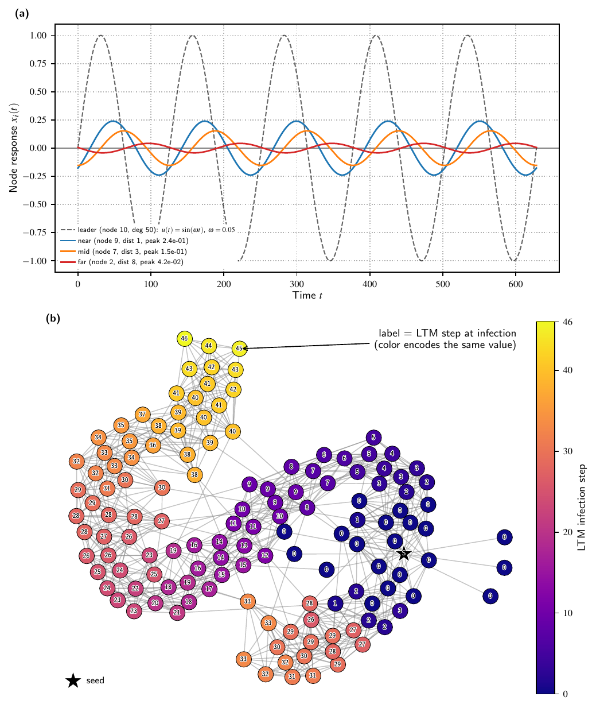

# Scale-Free-Social-Contagion

Data-availability and reproducibility for 

```bash
"How social contagions shape collective consensus in the presence of scale-free networks"
```

<p align="center">
  
</p>

<p align="center">Figure S21: leader-follower response + LTM cascade illustration (<a href="figures/Figure_S21.pdf">PDF</a>).</p>

## Environment

See [requirements.txt](requirements.txt) for the exact package versions used.
On a local machine, `graph-tool` is easiest to get via conda-forge (it's
not pip-installable) - the rest can come from either conda or pip. 

```bash
conda create -n scale-free-social-contagion -c conda-forge python=3.10 graph-tool=2.56 \
    numpy=1.25.2 pandas=2.1.0 scipy=1.11.2 networkx=3.4.2 matplotlib=3.7.2
conda activate scale-free-social-contagion
pip install ipykernel  # only needed to run the notebooks under scripts/figures/
```

(If you're instead on the HPC cluster this was originally produced on,
the same packages come from environment modules instead:
`module load StdEnv/2020 gcc/9.3.0 graph-tool/2.56 python/3.10`.)

## Pipeline

`nets/` is produced by the generation pipeline in `scripts/` (network
generation → CSV extraction → eigenvalue precompute, per model/dataset) -
see [scripts/README.md](scripts/README.md) for the full stage-by-stage
breakdown and run order.

## Data

Due to the high size of `nets/`, it is packaged into `<=10MB` compressed chunks under `data/` for upload to a release target with a per-file size limit - see
[data/README.md](data/README.md) for the full archive list and why it's
chunked. The seed values used to generate the data are included in the models' README files.

To uncompress/reassemble an archive, use `reassemble.sh` from this
directory:

```bash
bash reassemble.sh LFC_240_ws     # one archive
bash reassemble.sh all            # every archive
```

It concatenates the parts, verifies the result against
`data/checksums_full.sha256`, and extracts it into `data/`.


## Figures

Once `nets/` is populated, `scripts/figures/Figure_generator_nets_manual.ipynb` turns it into the paper's figures under `figures/` (flat, one PDF per figure).
## Folder structure

```
.
├── README.md                    # this file
├── LICENSE                       # CC BY 4.0
├── requirements.txt              # Python packages used (see "Environment" above)
├── reassemble.sh                 # reassembles data/*.tar.gz.part* archives
│
├── scripts/                      # generation + figure pipeline (see scripts/README.md)
│   ├── LFC/                       # N=240 LFC sweep (generate/extract/eig-cache)
│   ├── LFC_largeN/                # N=1000/5000 LFC sweep (mhk only)
│   ├── LTM/                       # N=1000 LTM cascade realizations
│   ├── real_world/                # Netzschleuder real-world reference networks
│   ├── pooling/                   # shared lfc_data_loader.py utility
│   └── figures/                   # notebooks: nets/ -> figures/ PDFs
│
├── nets/                          # generated network data (see scripts/README.md)
│   ├── LFC/{240,1000,5000}/{ws,mhk,ke}/...
│   ├── LTM/1000/{ws,mhk,ke}/...
│   └── real_world/{scale_free,small_world}/...
│
├── figures/                       # paper figures (Figure_1.pdf ... Figure_S21.pdf)
│
├── data/                          # chunked <=10MB archives for external upload
│   ├── README.md                  # archive list, why chunked, how to reassemble
│   ├── checksums_full.sha256      # sha256 of each whole (reassembled) archive
│   ├── checksums_parts.sha256     # sha256 of each individual chunk
│   └── <archive>.tar.gz.part###   # e.g. LFC_240_ws.tar.gz.part000, part001, ...
│
└── logs/                          # SLURM job logs (populated at submission time)
```

## License

This work is licensed under a
[Creative Commons Attribution 4.0 International License (CC BY 4.0)](https://creativecommons.org/licenses/by/4.0/) -
see [LICENSE](LICENSE). You're free to share and adapt this data/code for any purpose, including commercially, as long as you give appropriate credit.
